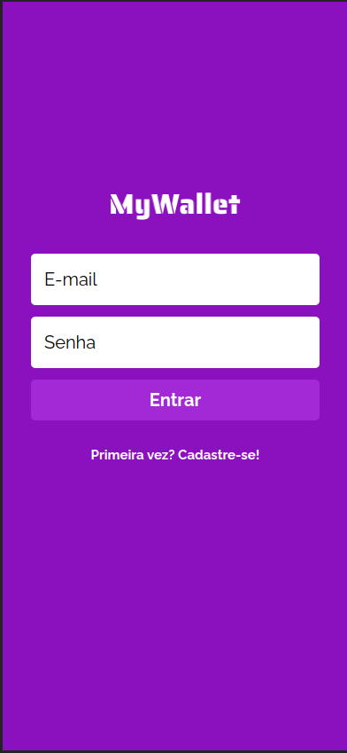
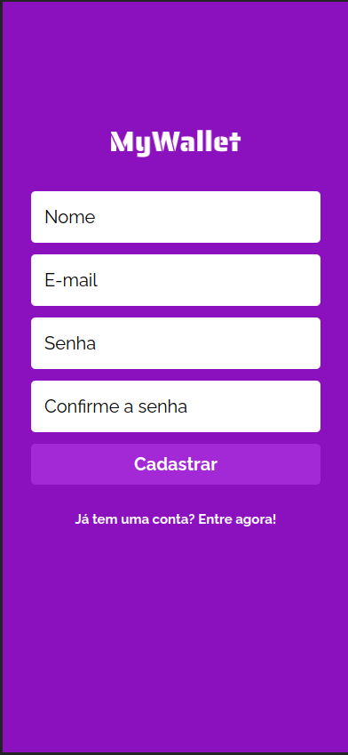
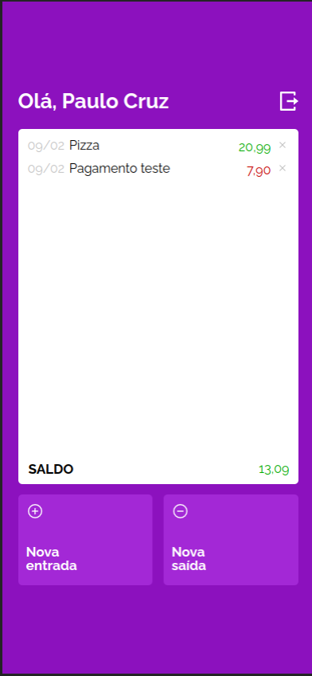
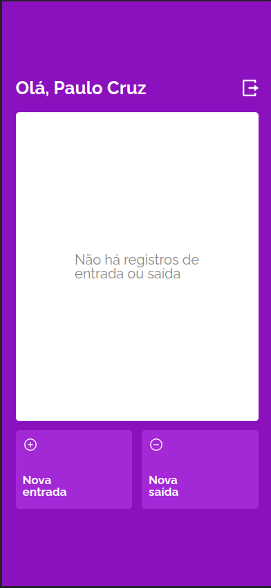
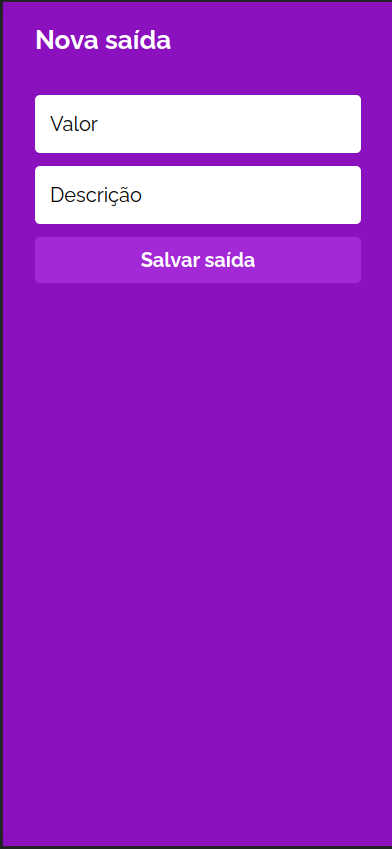

# <p align="center"> MyWallet Front-end </p>

<p align="center">
    
</p>

<p align = "center">
   
   
</p>

## :clipboard: Descrição

A aplicação MyWallet tem o objetivo de simular uma conta de transações financeiras online onde o usuário pode registrar depósitos e pagamentos inserindo a data e descrição em cada transação.

***

## :computer: Tecnologias

- JavaScript
- React, React Router Dom
- Context API

***

## :rocket: Rotas

### Rota `/`

- O usuário deve entrar com email e senha previamente cadastrados.
- Caso não possua cadastro é possível clicar no link abaixo do botão 'entrar' que irá redireciona-lo para a tela de cadastro.

<div align='center'>
    
</div>

### Rota `/SignUp`

- O usuário irá cadastrar no aplicativo o nome, E-mail, senha e confirmação de senha.
- Em caso de sucesso, será redirecionado para a tela de login (rota `/`).

<div align='center'>
    
</div>

### Rota `/MyAccount`

- Aqui é possível ver todas as transações feitas pelo usuário. Caso ele não possua nenhum depósito ou pagamento aparecerá uma mensagem avisando que não há registro de entrada ou saída.
- Nesta rota também existe a opção de registrar um depósito clicando em 'nova entrada' e de registrar um pagamento clicando em 'nova saída'.

<div align='center'>
    
    
</div>

### Rota `/New-deposit` e `/New-payment`

- Em ambas as rotas é necessário fornecer o valor e a descrição da transação. Para registrar, bastar clicar em salvar entrada (para depósitos) ou salvar saída (para pagamentos).

<div align='center'>
    
    
</div>

***

## 🏁 Rodando a aplicação

Este projeto foi inicializado com o [Create React App](https://github.com/facebook/create-react-app), usando a versão 16 do [Node.js](https://nodejs.org/en/download/) e  a versão 8.12 do [npm](https://www.npmjs.com/) rodando localmente.

Primeiro, faça o clone desse repositório na sua maquina:

```
git clone https://github.com/PauloCruz06/projeto10-trackit
```

Depois, dentro da pasta, rode o seguinte comando para instalar as dependencias.

```
npm install
```

Finalizado o processo, é só inicializar o servidor
```
npm start
```
Também é importante a configuração das variáveis de ambiente de acordo com o arquivo [.env.example](https://github.com/PauloCruz06/mywallet-front/blob/main/.env.example) caso queira executar com uma [API](https://github.com/PauloCruz06/mywallet-back) localmente.
